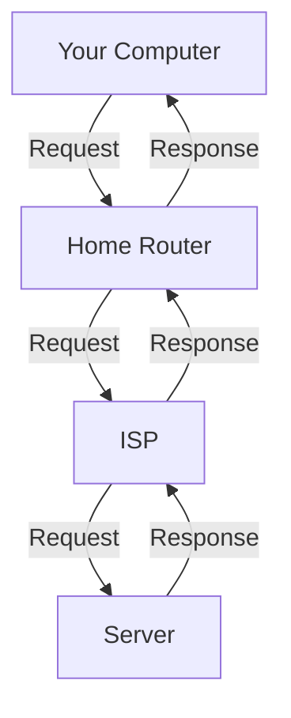

# Get and Secure Server

## Add a New User

If you want to set up a production ready Server, there are a few steps you should take.
This document goes through the list of steps that I personally take.

## 1. Create a New User with Sudo Permissions
```bash
# Log in as root
ssh root@IP_ADDRESS

# Create a new user
adduser workshop

# Add the user to the sudo group
usermod -aG sudo workshop

# Test the new user
su - workshop
sudo apt update
```
`-aG sudo` means:
Append the user `workshop` to the sudo group without removing them from any other groups they already belong to.


## 2. Set Up SSH Key Authentication

#### LOCAL MACHINE:
```bash
# generate an SSH key pair if you don’t already have one
ssh-keygen -t ed25519 -C "youremail@gmail.com" -f ~/.ssh/workshop_server_key

# Copy the SSH key to the new user on the server
ssh-copy-id -i ~/.ssh/workshop_server_key.pub workshop@IP_ADDRESS

# Test key-based login
ssh -i ~/.ssh/workshop_server_key workshop@IP_ADDRESS
```

After this we should be able to login without password requirement


## Use SSH 
SSH (Secure Shell) is a protocol for securely accessing remote computers. It encrypts the connection, ensuring that data transmitted over the network is secure.
Instead of using passwords, we will use SSH keys for authentication, which is more secure.
```bash
# AUTOMATICALLY COPY SSH KEY TO SERVER
# local machine (generate SSH key if you don't have one):
ssh-keygen -t ed25519 -C "your-email@example.com"
# Copy public key to server
ssh-copy-id root@YOUR_SERVER_IP
```

```bash
# OR MANUALLY
# local machine:
cat ~/.ssh/id_ed25519.pub
# copy the output and paste it into the server
mkdir -p ~/.ssh
echo "your-public-key-here" >> ~/.ssh/authorized_keys
chmod 700 ~/.ssh
chmod 600 ~/.ssh/authorized_keys
```


---

## Harden SSH

```bash
# Open SSH configuration file
sudo nano /etc/ssh/sshd_config

# Modify the following in the file:
# PermitRootLogin no # Disable root login
# PasswordAuthentication no  # Disable password based auth

# Restart SSH service
sudo systemctl restart ssh
```
DON`T CLOSE session, open another terminal, and test login:

```bash
# Test SSH with new settings before logging out
ssh -i ~/.ssh/workshop_server_key workshop@IP_ADDRESS
```

## 4. Set Up a Firewall (UFW)
```bash
# Install UFW if not already installed
sudo apt install ufw

# Allow necessary ports
sudo ufw allow OpenSSH    # SSH
sudo ufw allow 80/tcp     # HTTP
sudo ufw allow 443/tcp    # HTTPS

# Allow Kubernetes ports
sudo ufw allow 6443/tcp #apiserver
sudo ufw allow from 10.42.0.0/16 to any #pods
sudo ufw allow from 10.43.0.0/16 to any #services

# Enable UFW
sudo ufw enable

# Check UFW status
sudo ufw status
```

## 5. Install and Configure Fail2Ban (Optional but recommended)
Fail2Ban is a log-parsing application that scans log files for malicious activity and bans IP addresses that show signs of malicious behavior, such as repeated failed login attempts.
Written in Python, it is a great tool to prevent brute-force attacks.
https://github.com/fail2ban/fail2ban

```bash
# Install Fail2Ban
sudo su -
sudo apt update
sudo apt install fail2ban
```
Already prevents brute-force attacks on SSH by default, but we can customize it further.

Check if it is running:
```bash
sudo systemctl status fail2ban
```

Tail ssh log to see if it is working:
```bash
sudo tail -f /var/log/auth.log

```
Check current filters:
```bash
cd /etc/fail2ban/filter.d
ls -l
```

Check current jails:
```bash
cat /etc/fail2ban/jail.conf
```

### Customize SSH Jail
We can create a local configuration file to override the default settings without modifying the original `jail.conf` file. This is a good practice to ensure that your changes are not lost during updates.
We could also do this on jail.conf, but it is not recommended as it will be overwritten during updates.

```bash
tee /etc/fail2ban/jail.d/sshd.local > /dev/null <<'EOF'
[sshd]
enabled = true
port = 22
logpath = /var/log/auth.log
maxretry = 3
findtime = 30
bantime = 300
ignoreip = 127.0.0.1 ::1 192.168.1.0/24
EOF
```
Do not block for a long time, since it can add unnecessary load to the server firewall if many IPs are blocked.

### Restart
we need to restart the Fail2Ban service to apply the changes we made.
```bash
sudo systemctl restart fail2ban.service
sudo systemctl status fail2ban.service
```

Check jail status:
```bash
sudo fail2ban-client status
```

### Check F2B logs
```bash
sudo tail -f /var/log/fail2ban.log
sudo fail2ban-client status
```


## Base IPTables
Every request has a source and destination IP address, and a source and destination port.
It goes from your computer to your home router, then to your ISP, and finally to the server.


### IPTables vs NFTables
IPTables is a user-space utility program that allows a system administrator to configure the IP packet filter
rules of the Linux kernel firewall, implemented as different Netfilter modules.
NFTables is the successor to IPTables, providing a simpler and more consistent interface for managing firewall rules.
It is recommended to use NFTables for new installations, but IPTables is still widely used.
Most Linux distributions still use IPTables by default, but you can switch to NFTables if you prefer.
You can check which one is in use by running:
```bash
sudo iptables -L
sudo nft list ruleset
```
