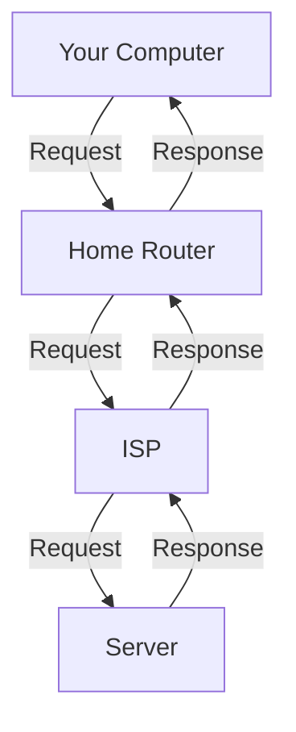

# Secure Server

## 1. Harden SSH

```bash
# Open SSH configuration file
sudo nano /etc/ssh/sshd_config

# Modify the following in the file:
# PermitRootLogin no # Disable root login
# PasswordAuthentication no  # Disable password based auth

# Restart SSH service
sudo systemctl restart ssh
```
DON`T CLOSE session, open another terminal, and test login:

```bash
# Test SSH with new settings before logging out
ssh -i ~/.ssh/test_server_key test@IP_ADDRESS
```

## 4. Set Up a Firewall (UFW)
```bash
# Install UFW if not already installed
sudo apt install ufw

# Allow necessary ports
sudo ufw allow OpenSSH    # SSH
sudo ufw allow 80/tcp     # HTTP
sudo ufw allow 443/tcp    # HTTPS

# Allow Kubernetes ports
sudo ufw allow 6443/tcp #apiserver
sudo ufw allow from 10.42.0.0/16 to any #pods
sudo ufw allow from 10.43.0.0/16 to any #services

# Enable UFW
sudo ufw enable

# Check UFW status
sudo ufw status
```

## 5. Install and Configure Fail2Ban (Optional but recommended)
Fail2Ban is a log-parsing application that scans log files for malicious activity and bans IP addresses that show signs of malicious behavior, such as repeated failed login attempts.
Written in Python, it is a great tool to prevent brute-force attacks.
https://github.com/fail2ban/fail2ban

```bash
# Install Fail2Ban
sudo su -
sudo apt update
sudo apt install fail2ban
```
Already prevents brute-force attacks on SSH by default, but we can customize it further.

Check if it is running:
```bash
sudo systemctl status fail2ban
```

Tail ssh log to see if it is working:
```bash
sudo tail -f /var/log/auth.log

```
Check current filters:
```bash
cd /etc/fail2ban/filter.d
ls -l
```

Check current jails:
```bash
cat /etc/fail2ban/jail.conf
```

### Customize SSH Jail
We can create a local configuration file to override the default settings without modifying the original `jail.conf` file. This is a good practice to ensure that your changes are not lost during updates.
We could also do this on jail.conf, but it is not recommended as it will be overwritten during updates.

```bash
tee /etc/fail2ban/jail.d/sshd.local > /dev/null <<'EOF'
[sshd]
enabled = true
port = 22
logpath = /var/log/auth.log
maxretry = 3
findtime = 30
bantime = 300
ignoreip = 127.0.0.1 ::1 192.168.1.0/24
EOF
```
Do not block for a long time, since it can add unnecessary load to the server firewall if many IPs are blocked.

### Restart
we need to restart the Fail2Ban service to apply the changes we made.
```bash
sudo systemctl restart fail2ban.service
sudo systemctl status fail2ban.service
```

Check jail status:
```bash
sudo fail2ban-client status
```

### Check F2B logs
```bash
sudo tail -f /var/log/fail2ban.log
sudo fail2ban-client status
```


## Base IPTables
Every request has a source and destination IP address, and a source and destination port.
It goes from your computer to your home router, then to your ISP, and finally to the server.



